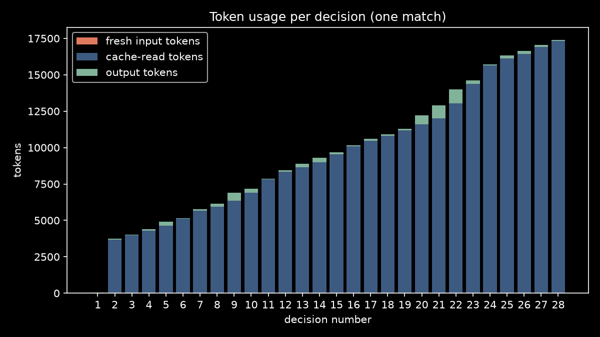
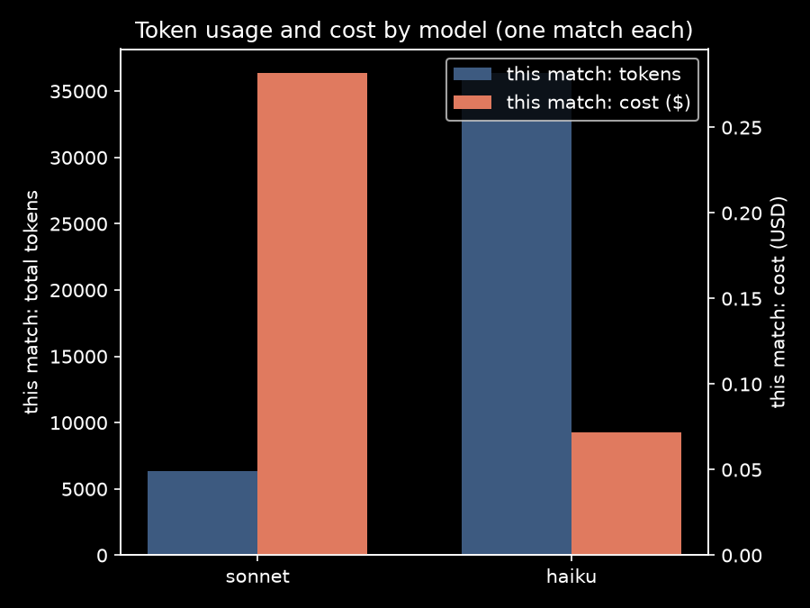

# showdown

Heads-up No-Limit Texas Hold'em in your terminal, against whatever
coding-agent CLI you have installed: Claude Code, Codex, or Gemini.
The agent runs from your launch directory, so it loads its own memory
files and knows who it's playing. It trash talks accordingly.

## Install

    go install github.com/wuhaohan772/showdown@latest
    showdown

Showdown scans your `PATH` for `claude`, `codex`, and `gemini`. If it
finds more than one, the menu asks which one you want across the felt.
If it finds none, install an agent CLI first; showdown has no built-in
opponent.

## Playing your first match

1. Run `showdown`. The menu shows your opponent, model, persona, and
   table-talk setting. Adjust anything, then start.
2. You get two hole cards. Blinds post automatically, starting at
   10/20.
3. On your turn: `f` fold, `c` check/call, `b` bet or `r` raise (then
   type an amount), `a` all-in.
4. The agent talks while it plays. Its chat runs in the panel on the
   right (or in the log line on narrow terminals). Press `t` any time
   to talk back.
5. When a hand ends, `enter` deals the next one. Blinds rise every 10
   hands. Play continues until someone busts, unless you capped the
   match with `--hands`.
6. At match over, the agent gets one parting shot, then the result
   posts to your career stats (with the API cost, for Claude).

## Keys

`f` fold · `c` check/call · `b`/`r` bet/raise (then amount) · `a` all-in ·
`t` trash talk · `enter` next hand · `q` quit

## Options

| Flag | What it does |
|------|--------------|
| `--agent claude` | Skip the picker, force this opponent (`claude`, `codex`, `gemini`) |
| `--model sonnet` | Model for the agent CLI. Claude: `haiku`/`sonnet`/`opus` (default `sonnet`). Codex: `gpt-6-luna`/`gpt-6-sol`/`gpt-6-astra` (default `gpt-6-sol`, always at low reasoning effort). Gemini values pass through |
| `--personality silent` | `standard` (trash talk, the default), `silent`, or a path to your own `.md` file (see below) |
| `--stack 1500` | Starting chips per player |
| `--blind 10` | Starting small blind (big blind is always 2x) |
| `--hands 20` | Cap the match at N hands (0 = play until bust) |
| `--quiet` | No table talk |
| `--debug` | Write a full JSONL transcript to `~/.showdown/` |
| `--theme dark` | Color theme: `auto` (default), `dark`, or `light`. Also read from `SHOWDOWN_THEME` |
| `--no-mouse` | Don't capture the mouse: clicking the mascot does nothing, and plain click-drag selects text again |
| `SHOWDOWN_REDUCE_MOTION=1` | Environment variable: skip all animations (deal, tweens, typewriter) |

Cards are dealt into place, chips tween, and the agent's trash talk types out live; set `SHOWDOWN_REDUCE_MOTION=1` if you want everything instant.

Showdown reads your terminal background and picks a light or dark palette. Detection misses on mid-grey backgrounds, where it can leave the dim text and the black suits hard to read — pass `--theme light` or `--theme dark` to settle it.

Play against Claude Code and clawd, its mascot, sits on the far side of the table: eyes flicking side to side while it decides, arms up when it drags a pot. Codex gets a little prompt bot that does the same. Click either one and it jumps or looks around, like clawd does in Claude Code. While showdown has the mouse, the table shows which key to hold to select text (fn in Terminal.app, ⌥ option in iTerm2, shift elsewhere); `--no-mouse` gives plain click-drag back.

## Personas

Two presets: `standard` (the default) talks trash and holds grudges;
`silent` plays without a word.

To write your own, put a `personality.md` at `~/.showdown/` (used
automatically) or pass any path with `--personality path/to/file.md`.
Cap is 2,000 characters. Describe how the opponent should talk; the
game handles the poker.

One thing showdown deliberately ignores: your Claude Code hooks and
plugins. They inject into every claude session, so a style plugin on
your machine (say, one that compresses all output into caveman speak)
would warp the opponent's table talk too. Showdown disables hooks in
the opponent's session; your memory files still load. If you want the
opponent to talk differently, use a persona — that's what it's for.

## Choosing a model

`sonnet` is the default and the recommendation. It plays fine and its
trash talk stays factually straight about who folded what.

`haiku` is cheaper and works, with one known quirk: right after
folding, it blames *you* for the fold about half the time ("can't
believe you folded that"). This is a model limitation, not a bug we
can prompt around, so if the taunts stop making sense on haiku, that's
why. Switch to sonnet if it bothers you.

For Codex the default is `gpt-6-sol`, Codex's mid tier and the closest
match to sonnet on cost and ability. `gpt-6-luna` is the fast, cheap
tier and `gpt-6-astra` the frontier one. Showdown always runs Codex at
low reasoning effort, whatever your `~/.codex/config.toml` says, so a
decision doesn't take minutes.

## Costs

Every agent decision is a real API call through your agent CLI, billed
however that CLI bills you. For Claude, the match-over screen shows what
the match cost, and completed matches accumulate into career stats at
`~/.showdown/stats.json`. Codex and Gemini don't report cost to
showdown, so their matches record wins and losses but no spend. Claude opponents keep one persistent session
per match, so decisions after the first are prompt-cache warm (roughly
10x cheaper than one-shot calls). A typical sonnet match runs well
under a dollar.

*Cache-read tokens (cheap) dominate after decision 1.*

*One match each, haiku vs sonnet.*

Quitting mid-match skips the career-cost entry; the `--debug`
transcript records every call's cost either way.

## When something looks wrong

Run with `--debug` (or `SHOWDOWN_DEBUG=1`). It writes a JSONL
transcript of every prompt, reply, and action to `~/.showdown/`, and
prints the path on exit. That file is the first thing to attach to a
bug report.

## How it works

The game sends the agent the rules, the current hand state, a digest of
the match so far, and the table-talk log; the agent replies with strict
JSON. A garbage reply gets one retry, then a forced check/fold. The
agent CLI runs in your launch directory on purpose, so it can read its
own memory and make the needling personal (see docs/adr/0002). Claude
runs as one long-lived session per match; codex and gemini spawn one
process per decision.
